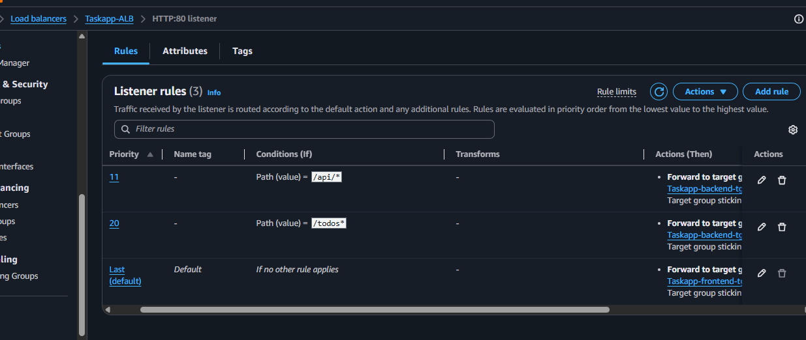

# Taskapp — PERN Stack Todo App on AWS EKS

A **PERN stack** (PostgreSQL, Express.js, React, Node.js) Todo application, containerized and deployed on **AWS** using Docker, Amazon ECR, Amazon EKS, Kubernetes, an Application Load Balancer, Amazon RDS for PostgreSQL, and Amazon CloudWatch.

This project focuses on the **DevOps and cloud infrastructure side**: taking an existing PERN Todo application and building a full production-style deployment pipeline around it — containerization, image management, Kubernetes orchestration, load balancing, network segmentation, and monitoring.

> The base application itself was **not built as part of this project** — it was sourced from [pern-stack-todo by AndrewJBateman](https://github.com/AndrewJBateman/pern-stack-todo). This repository documents the DevOps/infrastructure work: Docker, AWS, EKS, Kubernetes, and CloudWatch.


---

## 🚀 Live Stack Overview

| Layer | Technology |
|---|---|
| Frontend | React, served via Nginx |
| Backend | Node.js + Express.js REST API |
| Database | PostgreSQL (Amazon RDS) |
| Containerization | Docker, multi-stage builds |
| Image Registry | Amazon ECR |
| Orchestration | Amazon EKS (Kubernetes) |
| Load Balancing | AWS Application Load Balancer (ALB) |
| Networking | Amazon VPC, public/private subnets, NAT Gateway |
| Monitoring & Logs | Amazon CloudWatch |

---

## 🏗️ Architecture

```
                              INTERNET
                                 │
                                 ▼
                     ┌────────────────────┐
                     │   AWS ALB  :80      │
                     └──────────┬─────────┘
                                 │
                 ┌───────────────┴───────────────┐
                 ▼                                ▼
        Frontend Target Group             Backend Target Group
             (:30080)                          (:30500)
                 │                                │
                 ▼                                ▼
          EKS Worker Nodes                 EKS Worker Nodes
                 │                                │
                 ▼                                ▼
         Frontend NodePort                Backend NodePort
             :30080                           :30500
                 │                                │
                 ▼                                ▼
         Frontend Service                 Backend Service
                 │                                │
                 ▼                                ▼
        React / Nginx Pods (x2)          Node.js / Express Pods (x2)
                                                    │
                                                    │ PostgreSQL :5432
                                                    ▼
                                         Amazon RDS for PostgreSQL
```

**Request flow:** `User → Internet Gateway → ALB (public subnet) → Target Group → EKS NodePort (private subnet) → K8s Service → Pod → RDS PostgreSQL (private subnet)`

**Subnet placement:**
- **Public subnets:** ALB, NAT Gateway
- **Private subnets:** EKS worker nodes, application pods, Amazon RDS
- **Internet Gateway:** entry/exit point for the VPC, used by the ALB
- **NAT Gateway:** gives private-subnet resources (worker nodes) outbound internet access (e.g. pulling images, OS updates) without exposing them directly to the internet

---

## ✨ Features

Basic Todo CRUD functionality:

- Create a Todo
- View all Todos
- Edit a Todo
- Delete a Todo

---

## 📡 Backend API

Built with **Node.js + Express**, listening internally on port `5000`.

| Method | Endpoint | Description |
|---|---|---|
| `GET` | `/todos` | Get all Todos |
| `GET` | `/todos/:id` | Get a specific Todo |
| `POST` | `/todos` | Create a Todo |
| `PUT` | `/todos/:id` | Update a Todo |
| `DELETE` | `/todos/:id` | Delete a Todo |

`/todos` also doubled as the health-check endpoint during deployment — it confirmed the backend was reachable **and** able to talk to PostgreSQL.

---

## 🗄️ Database

PostgreSQL schema — `database/database.sql`:

```sql
CREATE TABLE todo(
  todo_id SERIAL PRIMARY KEY,
  description VARCHAR(255)
);
```

- **Production:** Amazon RDS for PostgreSQL (no local PostgreSQL container in production)
- **Backend config:** read from environment variables — `PG_USER`, `PG_PASSWORD`, `PG_HOST`, `PG_PORT`, `PG_DATABASE`
- **Credentials:** injected into the backend Deployment via a Kubernetes Secret (`postgres-secret`), **not committed to this repo**

---

## 🐳 Docker

### Backend
- Base image: `node:20-alpine3.22`
- Exposes port `5000`
- Start command: `node index.js`

### Frontend
- Multi-stage build:
  1. Build the React app
  2. Serve static files with `nginx:alpine`
- Exposes port `80`

---

## 📦 Amazon ECR

Docker images are pushed to ECR and pulled directly by the EKS Deployments.

| Repository | Example Image |
|---|---|
| `pern-backend` | `<account-id>.dkr.ecr.us-east-1.amazonaws.com/pern-backend:latest` |
| `pern-frontend` | `<account-id>.dkr.ecr.us-east-1.amazonaws.com/pern-frontend:latest` |

**Region:** `us-east-1`


---

## ☸️ Kubernetes Configuration

**Namespace:** `todo-app`


### Deployments

| Deployment | Replicas | Container Port |
|---|---|---|
| `pern-backend` | 2 | 5000 |
| `pern-frontend` | 2 | 80 |

Two replicas each give basic redundancy across EKS worker nodes.

### Services (NodePort)

NodePort is used because the ALB target groups route traffic directly to EKS worker node ports.

| Service | Port | Target Port | NodePort |
|---|---|---|---|
| `pern-frontend-service` | 80 | 80 | `30080` |
| `pern-backend-service` | 5000 | 5000 | `30500` |

### Manifests

```
kubernetes/
├── backend-deployment.yaml
├── backend-service.yaml
├── frontend-deployment.yaml
└── frontend-service.yaml
```

---

## ⚖️ AWS Load Balancer

An Application Load Balancer sits in front of the cluster with two target groups, both pointing at EKS worker node instance ports:

| Target Group | Protocol | Port | Target Type |
|---|---|---|---|
| Frontend | HTTP | 30080 | Instance |
| Backend | HTTP | 30500 | Instance |

Path-based listener rules route requests to the correct backend service:



Both target groups reporting healthy after deployment:


---

## 🔒 Security Groups

| Boundary | Rule |
|---|---|
| ALB SG | Allows inbound HTTP (80) from the internet |
| EKS Node SG | Allows inbound TCP `30080` and `30500` from the ALB SG |
| RDS SG | Allows inbound TCP `5432` only from the application (EKS) side — **not** exposed to the internet |

---

## 🌐 Networking

Built inside a custom **Amazon VPC** with:

- Public subnets (ALB)
- Private subnets (application/database resources where applicable)
- Internet Gateway
- NAT Gateway (outbound access for private resources)
- Custom route tables

---

## 📈 Monitoring — Amazon CloudWatch

Amazon CloudWatch was used to monitor the backend application in real time via **CloudWatch Application Map**, which visualizes the `pern-backend` service as a node and tracks its health.

Metrics tracked for the backend service:

| Metric | Purpose |
|---|---|
| **Requests & Availability** | Request volume over time and service availability (%) |
| **Latency** | Response time in milliseconds |
| **Faults (5xx)** | Server-side error count |
| **Errors (4xx)** | Client-side error count |
| **Health summary** | Aggregated error rate (4xx) and fault rate (5xx) at a glance |


---

## 📁 Project Structure

```
Taskapp_AWS_EKS_Deployment/
│
├── backend/
│   ├── Dockerfile
│   ├── db.js
│   ├── index.js
│   ├── package.json
│   └── package-lock.json
│
├── frontend/
│   ├── Dockerfile
│   ├── package.json
│   ├── package-lock.json
│   ├── public/
│   └── src/
│       ├── App.js
│       ├── App.css
│       ├── index.js
│       ├── index.css
│       └── components/
│           ├── InputTodo.js
│           ├── ListTodos.js
│           └── EditTodo.js
│
├── database/
│   └── database.sql
│
├── kubernetes/
│   ├── backend-deployment.yaml
│   ├── backend-service.yaml
│   ├── frontend-deployment.yaml
│   └── frontend-service.yaml
│
├── .gitignore
└── README.md
```

---

## 🔁 Deployment Flow

```
Source Code → Docker Images → Amazon ECR → Amazon EKS
   → Kubernetes Deployments → NodePort Services → AWS ALB → Internet
```

Database path (separate):

```
Backend Pods → PostgreSQL :5432 → Amazon RDS PostgreSQL
```

---

## ⚙️ Deploying to Kubernetes

Once `kubectl` is connected to the EKS cluster:

```bash
kubectl apply -f kubernetes/backend-deployment.yaml
kubectl apply -f kubernetes/backend-service.yaml
kubectl apply -f kubernetes/frontend-deployment.yaml
kubectl apply -f kubernetes/frontend-service.yaml
```

Verify:

```bash
kubectl get all -n todo-app
kubectl get pods -n todo-app
kubectl get svc -n todo-app
kubectl get endpoints -n todo-app
```

---

## 🩺 Key Troubleshooting Lessons

**1. A `404` isn't always a network failure**
Reaching the app but hitting an undefined route (`/`) returns `404` — that's an application-routing issue, not connectivity. `/todos` was used as the real health-check path since it actually exercises the backend and database.

**2. Health-check paths must match real application routes**
An ALB health check should hit an endpoint the app actually serves successfully.

**3. NodePort must match the target group port exactly**
- Frontend: `ALB → :30080 → Service → Pods`
- Backend: `ALB → :30500 → Service → Pods`

**4. Security groups must allow the real traffic path**
The ALB security group must be permitted to reach the EKS node ports being used.

**5. IAM errors ≠ infrastructure errors**
`AccessDenied` means a permissions problem, not that the resource itself is misconfigured or broken.

---

## 🛡️ Security Practices

- No secrets are committed to the repository
- Database credentials are supplied via **Kubernetes Secrets**, not plaintext files
- `.gitignore` excludes: `.env`, `.env.*`, `*.pem`, `*.key`, `*.crt`, `.kube/`, `.aws/`

**Never commit:** AWS access/secret keys, GitHub tokens, database passwords, private keys, `.env` files, or Kubernetes Secret manifests containing real values.

---

## ✅ Project Status

Successfully deployed and tested end-to-end on AWS, including:

- React frontend + Node/Express backend running as separate Deployments
- PostgreSQL on Amazon RDS
- Docker images built and pushed to Amazon ECR
- Kubernetes Deployments and Services live on Amazon EKS
- ALB routing verified via both frontend (`30080`) and backend (`30500`) target groups
- End-to-end Todo CRUD operations confirmed through the `/todos` API

> **Note:** The AWS infrastructure for this project (EKS cluster, ALB, RDS instance, etc.) has since been deleted to avoid ongoing AWS costs. The source code, Docker configuration, and Kubernetes manifests remain fully available in this repository and can be redeployed by following the steps above.

---

## 👤 Author

**Abdul Moiz**
GitHub: [@abdulmoiz672006](https://github.com/abdulmoiz672006)

## 📂 Repository

[Taskapp_AWS_EKS_Deployment](https://github.com/abdulmoiz672006/Taskapp_AWS_EKS_Deployment)
